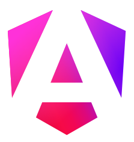

<h2>About me 👨‍💻👾</h2>
<ul>
    <li>Angular Lead Frontend developer at <a href="https://inno.tech/">Innotech Group</a> 🌐</li>
    <li>Creator of <a href="https://github.com/GraphLens/graphlens/">GraphLens VS Code Extension</a> 🔭</li>
    <li>Former lecturer of WebDev subjects at <a href="https://online.top-academy.ru/">TOP Computer Academy</a> 🧑‍🏫</li>
    <li>MS in Infocommunication Technologies and Systems 🎓</li>
    <li>Satellite Communications, MATLAB & Simulink Engineer 📡🛰️</li>
</ul>

<h3>My motivation 🏆</h3>

    I perceive Web development as an interesting constructor, in which, using well-mastered elements and tools, you can construct something new, your own and working. Also, sometimes this is became like a puzzle for me, in which the enjoy of the solution compensates for all the effort invested.

    I adhere to the idea that the Internet and modern, still young technologies can make our world better and more wealthy. And in general I look at Development as a good opportunity to contribute to this process.

<h3>How to reach me 📫</h3>

    Ask me anything or look what was asked by somebody else <a href="https://github.com/fosfor15/fosfor15/issues">here at the link to issues</a> 💬

<h2>Languages and Tools</h2>

    
    
    
    
    
    
    
    
    
    
    
    
    
    
    
    
    
    
    
    
    
    
    
    
    
    
    
    
    
    
    
    
    
    
    
    
    
    
    
    
    
    
    
    
    
    
    
    
    
    
    
    

<!-- Here are some ideas:
- 🔭 I’m currently working on ...
- 🌱 I’m currently learning ...
- 👯 I’m looking to collaborate on ...
- 🤔 I’m looking for help with ...
- 💬 Ask me about ...
- 📫 How to reach me: ...
- 😄 Pronouns:
...
- ⚡ Fun fact: ...
-->
